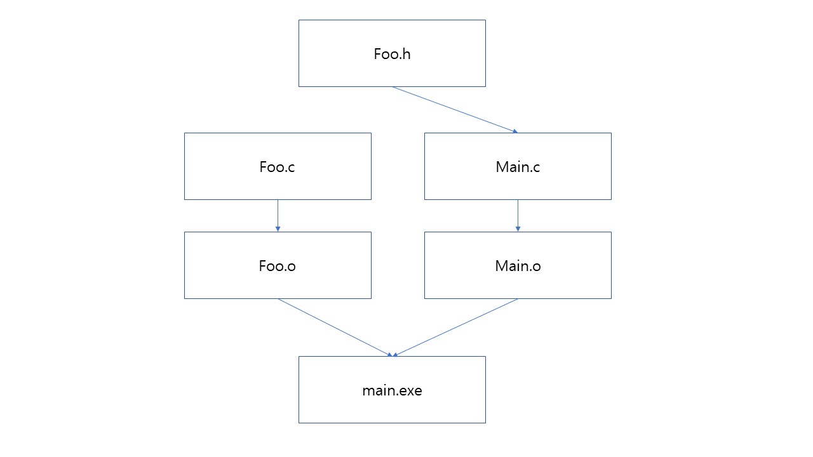
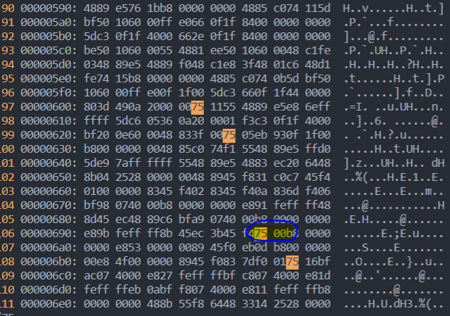
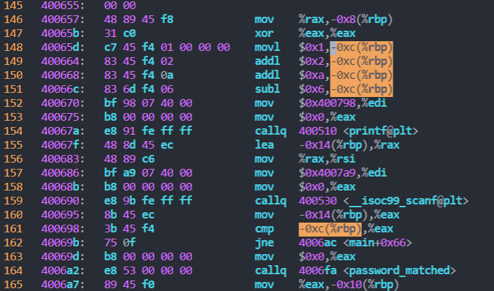

### 21/03/18 (목)
-------------------------
- 확장자 s : Assembler

- Conditional Compliation : 수정된 파일만 컴파일하기 위해서

- 링킹 : 필요한 파일 컴파일할 때 링킹

- 컴파일 -> 어셈블링 -> 링킹

- lsb msb 왜 메모리 주소당 8bit로 하나
        
        little endian(lsb) : endian(주소가 낮다.) -> lsb를 낮은 주소에서부터 채움 / 
        
        big endian(msb) : 

- :!%xxd / :!%xxd -r


# 1. 복습

## 1) makefile dependency 표현하여 conditional compilation 그리고 object들을 manual linking

- Dependency(의존성) : 최종 응용프로그램의 각 파일이 소스파일들과 어떻게 연관되어 있는지를 지정. 

```Makefile
foo.o: foo.c
	gcc -c foo.c

main.o: main.c 
	gcc -c main.c

all: foo.o main.o
	gcc -o main main.o foo.o
	./main
```


- 하나의 파일과 그 파일이 의존하는 파일을 정리
- main.exe 파일은 main.o와 foo.o 소스파일에 의존
- main.o 파일은 main.c 소스파일에 의존
- foo.o 파일은 foo.c 소스파일에 의존
- 서로 의존성을 가지는 파일끼리 컴파일한다.
```
make 명령어는 makefile의 의존성을 분석해 어떤 파일들을 어떤 순서로 만들 것인지 결정!!
```

## 2) hex disassembling, editing, assembling 과정
1. 해당 실행파일을 소스코드 파일로 하나 만든다.
	```
	objdump -x -S [파일 명] [파일 명_dis.s]
	```

	- 파일을 vi에디터로 열어보면 어셈블리어로 된 소스코드를 볼 수 있다!
	
2. 수정 모드에서 수정하고 싶은 명령코드의 값을 바꾼다.

## 3) binary executable 코드를 hex editing하여 함수 호출 흐름 변경
1. 실행파일을 vi에디터로 연다.
	```
	vi [파일 명.exe]
	```
	- 이때 파일을 열면 아스키코드로 나오는데 이것을 hex코드로 변환해준다.
		```
		:%!xxd
		```

	- 소스코드 파일에서 수정하고 싶은 명령어의 hex코드를 검색 후 수정한다.

	- 다시 저장할 때는 원래의 아스키코드로 변환 후 저장!
		```
		:%!xxd -r		
		```


-----------------------------------------

</br>

# 2. 과제
## 1) 암호 체크 루틴을 우회하도록 프로그램 변경
        
1. 우선 foo 파일을 실행 가능한 실행파일로 바꿔준다.
	
	```
	chmod +x foo

	./foo
	```

	

	- 실행 후 패스워드를 입력하면 당연히 모르기 때문에 잘못된 패스워드라고 뜬다.


2. Disassembly code를 확인하기 위해 foo파일의 소스코드 파일을 생성한다.

	```
	objdump -x -S foo > foo_dis.s
	```

3. 파일을 vi에디터로 실행 후 메인함수를 분석해본다.

	

	- 비밀번호가 맞다면 password_matched 함수를, 틀리면 password_unmatched 함수를 실행한다.

	- 161 : cmp를 통해 입력받은 값과 저장된 패스워드를 비교 후 플래그 레지스터에 값을 저장한다.

	- 162 : jne 플래그 레지스터의 값에 따라 점프할 지 안할 지 정한다. 만약 두 값이 틀리다면 (비밀번호가 틀리다면) 0f만큼 점프하여 다음 명령어를 실행하고 일치하면(비밀번호가 맞다면) 바로 다음 줄의 명령어를 실행한다. 

	- ## 이때 비밀번호가 틀렸을 때 바로 다음 줄로 분기하게 한다면 비밀번호가 틀려도 password_matched 함수를 실행하게 된다.


4. 분기값을 수정한다. 

	현재 분기는 0f만큼 이동하는데 이것의 값을 바꿔 바로 다음 명령어가 실행되게 하면 된다.

	

	그래서 foo 파일의 binary 코드에서 분기하는 명령어의 코드를 찾아 값을 수정해주었다.

	다음 줄이 실행되게 하기 위해 분기값을 0으로 수정

	(0f -> 00)

5. 실행 결과

	

	아무 비밀번호를 입력하여도 password_matched 함수가 실행된다.

</br>

## 2) 진짜 비밀번호 찾기

1. 비밀번호를 체크하려면 맞는 비밀번호와 입력한 비밀번호를 비교할 것이다.

	

	- 159 : 입력을 받는 scanf함수 호출 후 
	- 160 : 그 값을 eax레지스터에 저장
	- ### 161 : -0xc(%rbp) 이 주소에 저장된 값과 비교를 한다.

	그러면 -0xc 주소의 값을 보면 되므로
	- 148 : 맨 처음 메모리에 1을 넣고
	- 149 : + 2
	- 150 : + a(10)
	- 151 : -6

	을 수행해주면 1 + 2 + 10 - 6 = 7이 되므로 비밀번호는 7이다.

2. 확인

	

	- 성공적