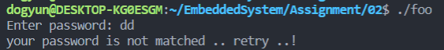
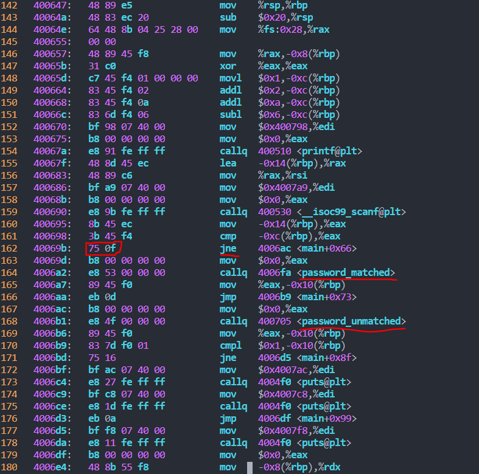
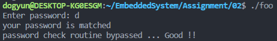

### 21/03/18 (목)
-------------------------
- 확장자 s : Assembler

- Conditional Compliation : 수정된 파일만 컴파일하기 위해서

- 링킹 : 필요한 파일 컴파일할 때 링킹

- 컴파일 -> 어셈블링 -> 링킹

- lsb msb 왜 메모리 주소당 8bit로 하나
        
        little endian(lsb) : endian(주소가 낮다.) -> lsb를 낮은 주소에서부터 채움 / 
        
        big endian(msb) : 

- :!%xxd / :!%xxd -r


# 1. 복습


# 2. 과제
## 암호 체크 루틴을 우회하도록 프로그램 변경
        
1. 우선 foo 파일을 실행 가능한 실행파일로 바꿔준다.
	
	```
	chmod +x foo

	./foo
	```

	
	- 실행 후 패스워드를 입력하면 당연히 모르기 때문에 잘못된 패스워드라고 뜬다.


2. Disassembly code를 확인하기 위해 foo파일의 어셈블리어 파일을 생성한다.

	```
	objdump -x -S foo > foo_dis.s
	```

3. 파일을 vi에디터로 실행 후 메인함수를 분석해본다.

	

	- 161 : cmp를 통해 입력받은 값과 저장된 패스워드를 비교 후 플래그 레지스터에 값을 저장한다.

	- 162 : jne 플래그 레지스터의 값에 따라 점프할 지 안할 지 정한다. 만약 두 값이 틀리다면 (비밀번호가 틀리다면) 0f만큼 점프하여 다음 명령어를 실행하고 일치하면(비밀번호가 맞다면) 바로 다음 줄의 명령어를 실행한다. 

	이때 비밀번호가 틀렸을 때 바로 다음 줄로 분기하게 한다면 비밀번호가 틀려도 맞는 함수를 실행하게 된다.


4. 분기값을 수정한다. 

	현재 분기는 0f만큼 이동하는데 이것의 값을 바꿔 바로 다음 명령어가 실행되게 하면 된다.

	

	그래서 foo 파일의 binary 코드에서 분기하는 명령어의 코드를 찾아 값을 수정해주었다.

	다음 줄이 실행되게 하기 위해 분기값을 0으로 수정

	(0f -> 00)

5. 실행 결과

	

	아무 비밀번호를 입력하여도 올바른 패스워드가 입력될 때의 함수가 실행된다.