### 21/03/25 (목)
----------------------------

# 1. 복습

## 1. ARM cross compiler 설치 및 구동

0. cross compiler?
    
    - 컴파일이 불가능한 곳에서 컴파일을 하여 실행파일을 생성하는 데 사용하기 위한 것이다.
    - 임베디드 시스템에서 실행파일을 생성하는 데 사용된다.
    - 컴파일러가 동작하는 시스템과 생성된 실행파일이 동작하는 시스템이 다를 때 사용

        > 우리는 PC의 `가상머신`에서 컴파일하고 `임베디드 프로세서`에서 실행해아 한다.
    
    - ARM기반 프로세서에서 실행하기 위해서는 arm-linux-gcc같은 ARM  컴파일러를 사용해야 한다. 그럼 설치를 해보자!


1. 설치페이지 접속

    > https://developer.arm.com/tools-and-software/open-source-software/developer-tools/gnu-toolchain/gnu-rm/downloads

2. gcc-arm-non-eabi-10-2020-q4-major-x86_64-linux.tar.bz2 다운로드

    - 우리 노트북은 윈도우 운영체제이지만 가상머신에서는 리눅스 환경의 우분투 운영체제로 구동되므로 리눅스용 파일을 다운받는다.

3. 압축해제

    - GUI 환경에서 압축해제 또는
    - 터미널에서 압축해제
        ```
        bunzip2 [파일 명]
        ```
        확장자 `.bz2`은 bzip2로 압축 된 파일이라 bunzip 명령어로 압축해제 

4. 실행

    - 실행파일은 `bin` 디렉토리에 있다. 이동하여 실행해보자.
    - 다양한 컴파일러가 존재하고 우리는 arm-none-eabi-gcc 컴파일러를 사용할 것이다.
    - 디버깅으로는 arm-none-eabi-gdb를 사용한다.

        ```
        ./arm-none-eabi-gcc
        ```

        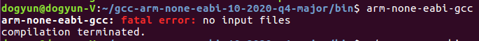


5. 경로확인

    - 환경변수에 등록해주기 위해 실행파일의 경로를 확인한다. 현재 디렉토리의 절대경로를 알 수 있는 명령어를 통해 확인한다.
        ```
        pwd
        ```

        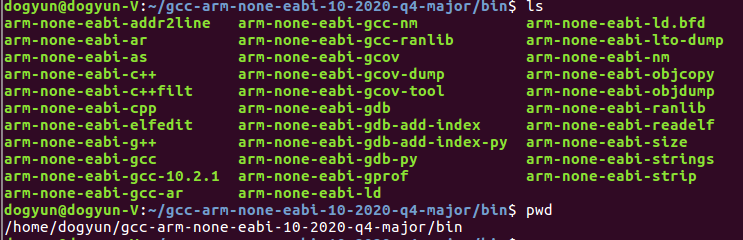
        > 경로 : /home/dogyun/gcc-arm-none-eabi-10-2020-q4-major/bin

    


## 2. ARM Emulator (QEMU) 설치 및 구동

0. QEMU?

    - 프로세스 및 주변기기를 에뮬레이션 하는 툴

    - HVM 방식을 지원한다. HVM방식이란 Hardware virtual Machine의 약자로 직역하면 하드웨어 가상 머신이다. 우리는 실제 사용할 임베디드 기판을 가상화하여 코드를 업로드하고 `디버깅`하기 위해 이를 사용한다.

    - QEMU에서 하드웨어에 대한 접근 요청과 신호를 받고 이것을 하드웨어 가상머신으로 전달한다. 

    - 설치하는 방법은 두가지가 있다. 첫번째로 공식 홈페이지에 들어가 파일을 다운로드 받는 방법과 두번째로는 우분투 패키지 관리자로 설치하는 방법이 있다. 우리는 첫번째 방법인 홈페이지에서 직접 파일을 다운로드받아 설치할 것이다.
        ```
        apt-get install qemu
        ```
        (우분투 패키지 관리자로 설치하는 방법)

1. 설치 페이지 접속
    
    > https://xpack.github.io/qemu-arm/install/
    >
    > 또는
    > 
    > https://github.com/xpack-dev-tools/qemu-arm-xpack/releases/
    >
    > 접속

2. xpack-qemu-arm-2.8.0-12-linux-arm64.gar.gz 다운로드
    - 우리 노트북은 윈도우 운영체제이지만 가상환경은 리눅스로 돌아가기 때문에 리눅스용 파일을 다운로드 받아야 한다!

3. 받은 파일 압축 해제
    - GUI 환경에서 압축해제 또는
    - 터미널에서 압축해제
        ```
        gunzip [파일 명]
        ```
        확장자 `.gz`은 gzip으로 압축 된 파일이라 gunzip으로 압축해제

4. 실행

    - 실행파일은 `bin` 디렉토리에 있다. 이동하여 실행해보자.


        ```
        ./qemu-system-gnuarmeclipse
        ```
        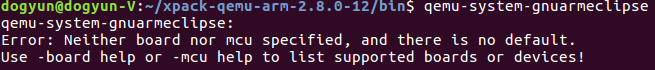

        아직 어떤 펌웨어도 로딩하지 않아서 에러 메세지가 출력된다.

5. 경로확인

    - 환경변수에 등록해주기 위해 실행파일의 경로를 확인한다. 현재 디렉토리의 절대경로를 알 수 있는 명령어를 통해 확인한다.
        ```
        pwd
        ```

        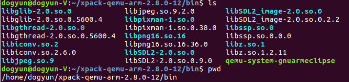
        > 경로 : /home/dogyun/xpack-qemu-arm-2.8.0-12/bin


## 3. 환경변수 설정 원리

0. 환경변수?
    
    - 파일의 실행경로를 추가하여 현재 디렉토리의 위치에 상관없이 다른 경로에 있는 원하는 프로세서를 실행할 수 있게한다.

1. 환경변수를 설정해줄 수 있는 파일을 연다.

    ```
    vi ~/.bashrc
    ```
    - .bashrc 파일은 bash가 수행될 때 실행되는 함수를 제어하는 지역적인 시스템 설정과 관련된 파일이다. 여기에 우리가 실행하고 싶은 프로세서 경로를 추가해주면 된다. 

2. 파일에 환경변수를 추가해준다.

    - gcc와 qemu 파일의 환경변수를 bashrc 파일 하단에 추가해준다.

        ```
        export PATH="/home/dogyun/gcc-arm-none-eabi-10-2020-q4-major/bin:/home/dogyun/xpack-qemu-arm-2.8.0-12/bin:$PATH"
        ```

    - 이제부터 우리는 어떤 디렉토리에서도 저 경로에 있는 실행파일을 사용할 수 있다.


## 4. ARM firmware project file 분석

1. Makefile

    ```makefile
    CC=arm-none-eabi-gcc
    LD=arm-none-eabi-gcc
    OBJCOPY=arm-none-eabi-objcopy

    CFLAGS=-mcpu=cortex-m4 -mthumb -mfloat-abi=hard -mfpu=fpv4-sp-d16 -DSTM32 -DSTM32F4 -DSTM32F411VETx -DSTM32F411E_DISCO
    CFLAGS+=-DDEBUG -DSTM32F411xE -DUSE_STDPERIPH_DRIVER -O0 -g3 -Wall -fmessage-length=0 -ffunction-sections -c -MMD -MP
    LFLAGS=-mcpu=cortex-m4 -mthumb -mfloat-abi=hard -mfpu=fpv4-sp-d16 -T"LinkerScript.ld" -Wl,-Map=out.map -Wl,--gc-sections

    all:
        $(CC) $(CFLAGS) main.c
        $(CC) $(CFLAGS) startup.s
        $(LD) $(LFLAGS) -o out.elf main.o startup.o

    bin:
        $(OBJCOPY) -O binary "out.elf" "out.bin"

    gdb:
        arm-none-eabi-gdb

    qemu:
        qemu-system-gnuarmeclipse --verbose --verbose --board STM32F4-Discovery --mcu STM32F407VG --gdb tcp::1234 -d unimp,guest_errors --semihosting-config enable=on,target=native --semihosting-cmdline out
    ```

    - CC = arm-none-eabi-gcc : 컴파일러 매크로 지정

    - LD = arm-none-eabi-gcc : 링커 컴파일러 매크로 지정 

    - CFLAGS : c 컴파일러의 플래그들

    - LFLAGS : lex 플래그들

    - all : 파일들 컴파일하여 

    - gdb : 디버거 실행

    - qemu : qemu에 옵션에 해당하는 펌웨어 로딩 후 실행. 

       
2. main.c

    ```c
    #include <stdio.h>

    int main(void){

        unsigned int led  = 0;

        while(1){
        }

        return 0;
    }
    ```

    후에 보드에 업로드하여 디버깅을 해보기 위해 간단한 프로그램을 작성했다.


3. startup.s

    - 메모리 컨트롤러 레지스터 설정과 스택 어드레스 할당을 위해 어셈블러로 코딩.

    - 코드 설명
        ```s
            .syntax unified
            .cpu cortex-m4
            .thumb
        ```
        - Architecture 설정하는 부분
        ---

        ```s
        .global g_vectors		// g_vectors 
        .global Reset_Handler
        
            .section	.isr_vector, "a", %progbits
            .type		g_vectors, %object
            .size		g_vectors, .-g_vectors
        ```
        - isr vector 정의. 인터럽트 요청과 인터럽트 핸들러
        ---
        
        ```s
        g_vectors:					// 
            .word	_estack			// Stack pointer 
            .word	Reset_Handler	// HW
            .word	0				// NMI_Handler
            .word	0				// HardFault_Handler
            .word	0				// MemManage_Handler
            .word	0				// BusFault_Handler
            .word	0				// UsageFault_Handler
            .word	0			
            .word	0			
            .word	0			
            .word	0			
            .word	0				// SVC_Handler
            .word	0				// DebugMon_Handler
            .word	0
            .word	0				// PendSV_Handler
            .word	SysTick_Handler
            .word	0
        ```
         - 인터럽트 백터 테이블 부분

        - 스택포인터 초기화 및 다양한 핸들러 초기화.
        ---
        ```s
        Reset_Handler:			// 
            bl main				// 
        ```
        - 핸들러 호출 시 main 실행 
        ---
       

4. Load Script

    - 링크 스트립트에서 메모리의 사용 영역을 지정해줄 수 있다.

        ```s
        ENTRY(Reset_Handler)

        _estack = 0x20020000; /* end of RAM */

        MEMORY
        {
            RAM (xrw)	: ORIGIN = 0x20000000, LENGTH = 128k    /* SRAM */
            ROM (rx)	: ORIGIN = 0x08000000, LENGTH = 512k    /* code */
        }
        ```
        - RAM의 마지막 주소 (스택영역의 마지막)를 0x20020000으로 지정
        - RAM의 시작 주소는 0x20000000, ROM의 시작주소는 0x08000000이고 이를 그림으로 보자.

            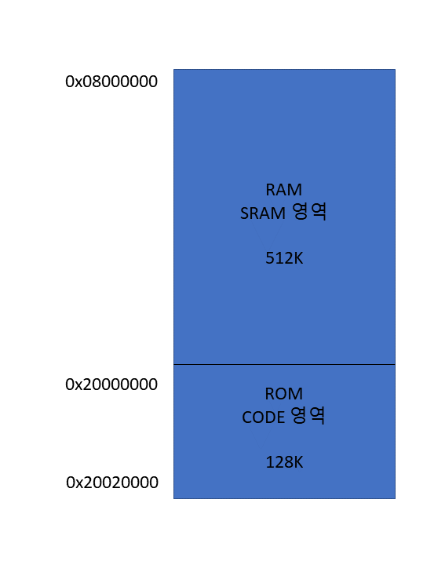
        ---
        ```s
        SECTIONS
        {
            .isr_vector	: 
            {
                . = ALIGN(4);
                KEEP(*(.isr_vector))
                . = ALIGN(4);
            } >ROM

            .text :
            {
                . = ALIGN(4);	
                *(.text)
                . = ALIGN(4);	
            } >ROM

        }
        ```
        - 각 테이블이 사용할 메모리를 정해준다. 지금은 isr_vector와 text 둘 다 ROM을 사용할 것이다.


5. 전체 파일 구조

    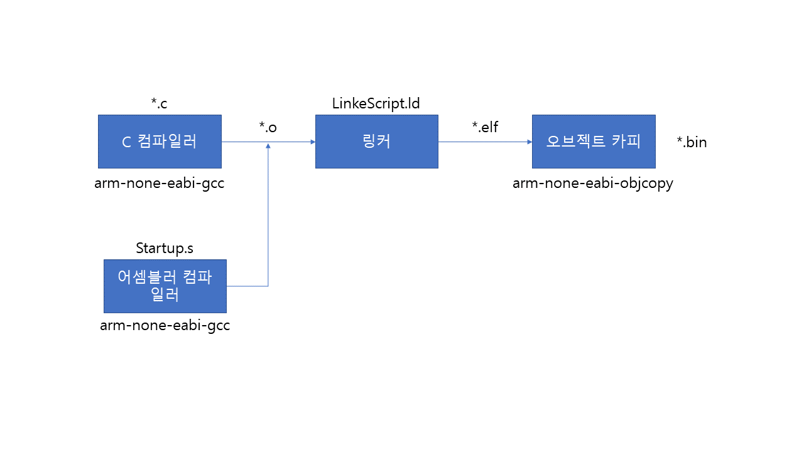


## 5. QEMU에 펌웨어 로딩

1. makefile의 qemu 분석

    - 실행 옵션

        1. verbose : 에러 및 상태에 대한 설명 출력해준다. 

        2. board : STM32F4-Discovery 이름의 보드 에뮬레이터 사용

        3. mcu : STM32F407VG 타입의 보드 사용.

        4. gdb : qemu는 실행 시 디버거를 같이 실행하는 데 디버거 서버와 연결하기 위해 tcp포트번호를 명시하여 디버거와 연결한다.

        5. d : 에뮬레이터 실행하면서 문제가 생기면 알려주는 옵션.

        6. semihosting-config : Arm semihosting 프로토콜을 사용할수 있게 하는 옵션.

        7. semihosting-cmdline : 에뮬레이터에서 커맨드명령어 입력을 위해 사용. 반드시 마지막에 위치해야 함!

2. qemu 실행

    ```
    make qemu
    ```

    하면 위에 명시 된 보드와 에뮬레이터 옵션을 가진 HVM가 실행된다.

    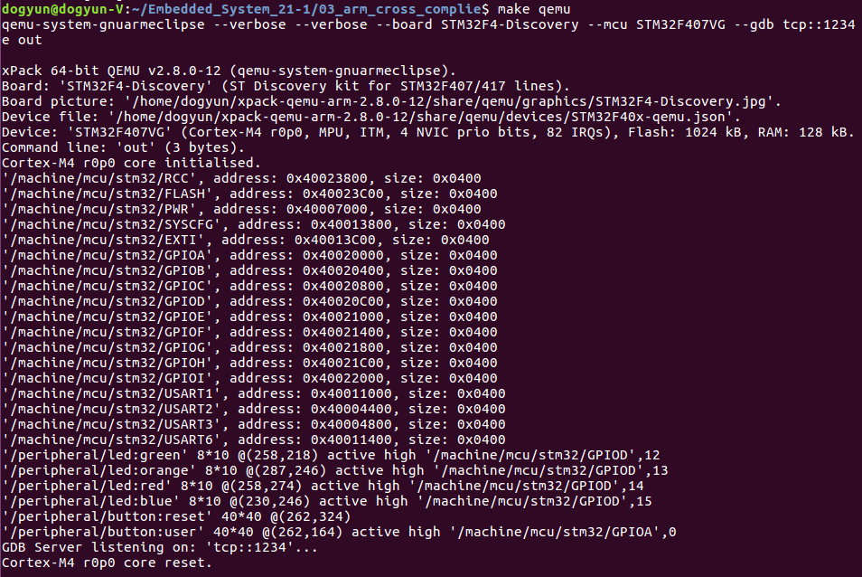
    
    - Board : STM32F-Discovery

    - Device : STM32F407VG

    - gdb server : 포트 1234 수신 중


## 6. gdb를 이용하여 타겟보드(에뮬레이터)에 접속하여 코드 실행 및 Tracing

1. makefile의 gdb 실행

    ```
    make gdb
    ```

    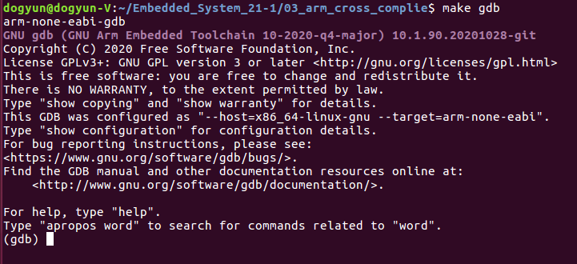


2. 에뮬레이터의 디버거 서버에 접속

    ```
    (gdb) target remote:1234
    ```

    - 에뮬레이터가 리스닝하고 있는 디버거 서버의 tcp 포트번호는 1234번이므로 1234에 접속한다. 연결이 되면 디버거에서 보내는 명령이나 신호를 보드에서 받아들일 준비가 된 것이다.


3. 보드에 파일을 업로드 후 로딩

    ```
    (gdb) file out.elf
    (gdb) load
    ```


4. 코드 실행
    
    ```
    (gdb) list
    ```
    - 현재 로드된 소스코드 내용을 보여준다.

        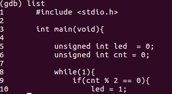

    ---
    ```
    (gdb) c
    ```

    - 전체 코드를 실행하는 명령어

        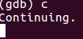
    ---
    ```
    (gdb) s
    ```

    - 한줄 씩 실행하는 명령어

        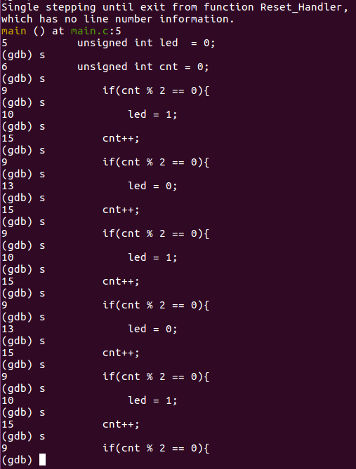


## 7. gdb를 써보면서, 칩 내부의 동작을 확인하면서 어떻게 실행되는지 분석 (main.c에 간단한 알고리즘 구동하는 코드 삽입필요)

1. main.c 구성

    ```c
    #include <stdio.h>

    int main(void){

        unsigned int led  = 0;
        unsigned int cnt = 0;

        while(1){
            if(cnt % 2 == 0){
                led = 1;
            }
            else{
                led = 0;
            }
            cnt++;
        }


        return 0;
    }
    ```
    - 디버깅을 위해 간단한 프로그램을 코딩해보았다.

2. 레지스터 정보 보기

    ```
    (gdb) info registers
    ```

    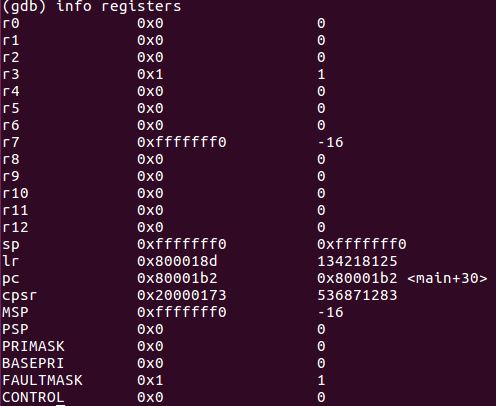


3. 단계별로 실행해보며 레지스터 값이 변하는 것을 확인한다.

    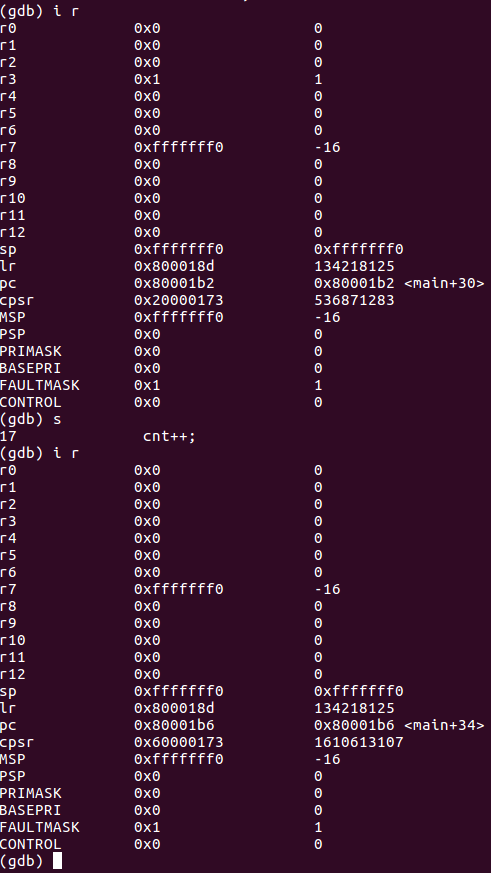

    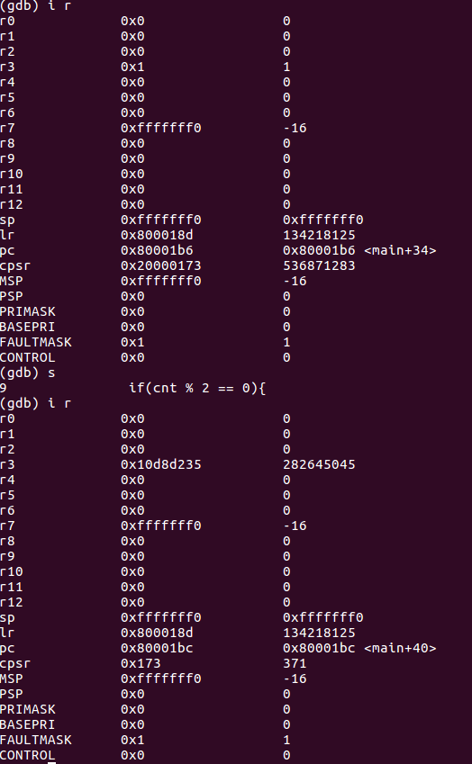

    - 레지스터 3의 값이 변화한다.

    - pc의 값이 분기 조건에 따라 변화한다.


# 2