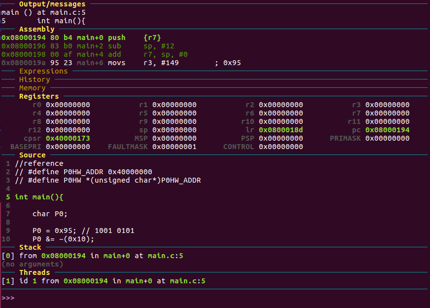
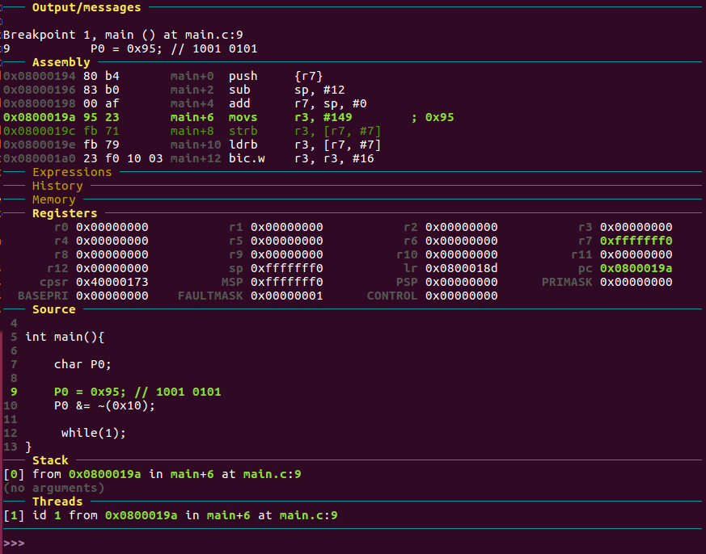
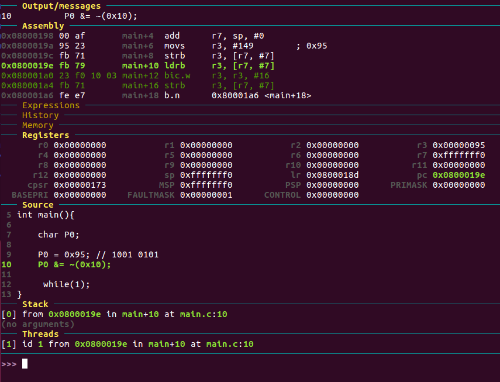
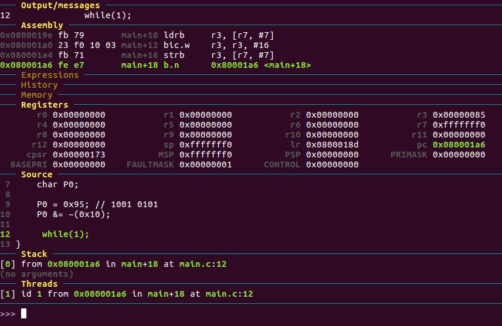
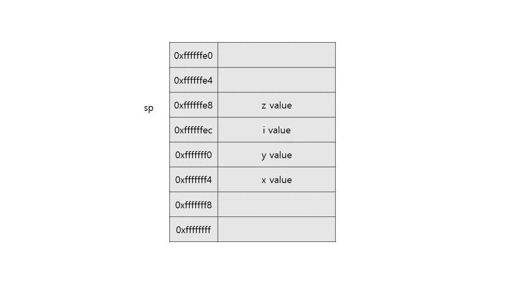
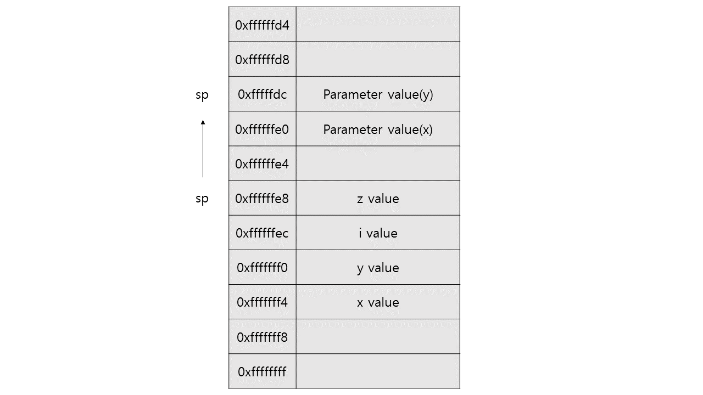
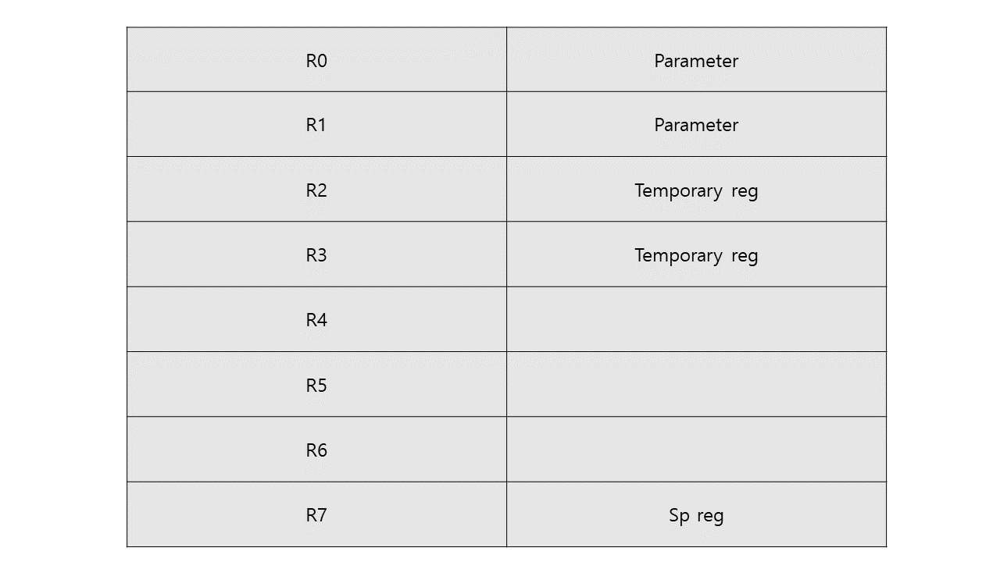

### 21/04/01 (목)
---------------------------

db memory watch 0xfffffff0


디버깅 실행
1. make gdb
2. target remote:1234
3. file out.elf
4. load
5. b main
6. si(인스트럭션 단위로 진행), s(줄 단위로 실행), n(함수단위로 실행)

----------------------------
# 1. 복습
## 1. C 코드를 ARM cortex-m4 프로세서용으로 컴파일하고, 이를 프로세서 위에 로딩 후 (QEMU virtualization) 온칩에서 실행되는 과정을 gdb를 이용하여 step instruction 추적을 통해 실행과정을 분석하시오.

0. 소스코드 내용

    ```c
    int main(){
    
        char P0;
        
        P0 = 0x95; // 1001 0101
        P0 &= ~(0x10);
        
        while(1);
    }
    ```

    - P0에 0x95를 저장 후 P0의 5번째 비트를 0으로 바꿔주는 간단한 프로그램

1. ARM cortex-m4 프로세서용으로 컴파일

    ```Makefile
    make all
    make bin
    ```

    

    - -mcpu=cortex-m4 : 타겟 프로세서를 cortex-m4로 지정.

    - -mthumb : Trace32 디버깅 프로그램 사용.

    - -mfloat-abi=hard : 사용할 부동 소수점 ABI를 지정. hard 옵션은 부동 소수점 명령어 생성을 허용하고 FPU 별 호출 규칙을 사용.

    - mfpu=fpv4-sp-d16 : 부동 소수점 하드웨어 (또는 하드웨어 에뮬레이션)를 지정.

2. QEMU 가상머신 실행

    ```
    make qemu
    ```

3. gdb로 파일 로드

    ```
    make gdb

    target remote:1234  -> hvm 연결
    
    file out.elf
    load                -> 파일 로드

    b main              -> break point main으로 지정
    ```

4. 단계별로 실행

    ```
    si
    ```

    - step instruction의 약자로 명령어 단위로 단계별로 실행

    -----
    
    
    sp -12만큼 이동
    r7에 sp의 주소를 저장
    왜 12 이동? 여기서 12의 메모리에는 시스템의 기본적인 필요요소들이 저장되어 있다. 예약된 메모리 개념?

    
    
    r3에 149를 저장
    그리고 r3의 값을 r7에 있는 주소 + 7에 저장

    
    
    r3에 r7의 주소(sp) +7 에 저장된 값 불러와서 저장
    r3값과 16 and연산 후 r3에 저장
    r3값을 r7의 주소(sp) + 7에 저장

    

    반복문 분기하며 시행 


-----------------------------
## 2. C로 코딩하는 다양한 사례별로 Assembly code로 변환되어 실행되는 원리를 분석하시오. 
- main 소스코드
    ```c
    int sum(int a, int b){
        return a+b;
    }

    int main(void){
        
        int x;
        int y;
        int z;

        x = 3;
        y = 5;
        z = x + y;
        z = x - y;

        if(x > 3){
            x += 2;
        }
        else{
            x -= 2;
        }

        for(int i = 0; i < 5; i++){
            y += 1;
        }

        z = sum(x, y);

        return 0;
    }

    ```

0. 프로그램 초기화

    - sp 주소를 지정하고 이 주소를 레지스터에 저장한다.

        ```
        sp : 0xffffffff - 16 = 0xffffffe8
        r7 : 0xffffffe8
        ```

        - 스택영역 메모리는 0xffffffe8부터 시작이고 변수 메모리 할당하면 이 주소부터 저장됨

1. 변수에 값 저장

    - 레지스터에 값을 임시저장 후 이것을 메모리에 저장

        x = 3
        ```
        r3 <- 3
        [r7, #12] <- r3
        0xffffffe8 + c(12) = 0xfffffff4
        ```

        - 0xfffffff4에 x 할당. 3이 저장됨

        ----------
        y = 5
        ```
        r3 <- 5
        [r7, #8] <- r3
        0xffffffe8 + 8 = 0xfffffff0
        ```

        - 0xfffffff0에 y 할당. 5가 저장됨

2. 변수끼리 더하기 연산, 빼기 연산

    - 레지스터로 메모리 값 불러온 후 연산한 뒤 다시 메모리에 저장

        z = x + y
        ```
        r2 <- [r7, #12]
        r3 <- [r7, #8]
        ```
        - x, y값을 메모리에서 불러오기
        
        ----------
        ```
        r3 <- r3 + r2
        ```
        - 더하기 연산 후 

        ----------
        ```
        [r7, #0] <- r3
        0xffffffe8
        ```
        - 0xffffffe8에 z 할당. 연산결과인 r3가 저장됨

        ----------
        z = x - y
        ```
        r2 <- [r7, #12]
        r3 <- [r7, #8]
        ```
        - 메모리에 저장된 x와 y 값 레지스터로 load

        ----------
        ```
        r3 <- r2 - r3
        ```
        - 빼기 연산 후
        
        ----------
        ```
        [r7, #0] <- r3
        ```
        - z가 할당받은 주소인 0xffffffe8에 연산결과인 r3가 저장됨


3. 조건문

    - 비교할 값을 레지스터로 가져온 후 비교
        ```
        r3 <- [r7, #12](x)
        cmp r3, #3
        ```
        - r3 - #3가 0보다 작거나 같은 경우 0x80001dc로 분기 -> pc : 0x80001dc

        - 이후 2에서와 같이 빼기연산 수행
        

4. 반복문

    - for문에서 사용될 변수 i를 메모리에 저장
        ```
        r3 <- 0
        [r7, #4] <- r3
        ```

    - 반복문 실행 여부를 위해 i값을 불러와 조건과 비교
        ```
        r3 <- [r7, #4]
        cmp r3, #4
        ```
        - r3 - 4가 0보다 작거나 같은 경우 0x80001e8로 분기 -> pc : 0x80001e8
    
    - 조건을 만족하여 반복문 내의 명령어 시작으로 분기하여 실행
        
        y값 1추가

    - 다시 i값을 레지스터로 불러온 뒤 1을 더해주고 메모리에 변한 i값 저장

        그리고 다시 반복문 조건을 판단하여 반복문 실행을 반복

    - 반복 조건을 불만족 할 경우 다음 명령어 실행하며 반복문 탈출

    반복문이 실행되면서 임시 레지스터 값인 r3를 사용해서 메모리의 값을 받아 연산을 하여 계속 변하는 것을 볼 수 있었다. 

    - 메모리 사용

        

5. 함수 호출

    - 함수 call과 return 과정에서 stack 메모리와 레지스터가 어떻게 사용되는지 분석

        ```
        r1 <- [r7, #8] 
        r0 <- [r7, #12]
        ```
        - r0, r1에 x, y 저장 후 함수 sum 시작으로 분기

        ----------
        0x8000194부터 sum 함수 시작.

        - 스택에 함수가 종료된 후 메인의 되돌아갈 주소(r7에 저장된 값, sp)를 푸쉬 후 스택포인터 증가시킴. 증가된 sp 기준으로 함수 내에서 쓰이는 데이터가 저장됨.

        ```
        sp - 12
        sp = 0xffffffdc
        
        r7 <- sp
        ```
        - r7에 바뀐 sp 저장
        
        
        
        ----------
        - 매개변수인 x, y값이 들어있는 r0, r1값들을 메모리에 저장
        ```
        [r7, #4] <- r0
        [r7, #0] <- r1
        ```

        ----------
        ```
        r2 <- [r7, #4]
        r3 <- [r7, #0]

        r3 <- r3 + r2
        ```
        - r2, r3에 x, y가 저장된 메모리 값을 불러와서 저장 후 더하기 연산

        ----------
        ```
        r0 <- r3
        ```
        - 리턴값을 받는 r0에 결과 저장
        
        ----------
        ```
        r7 <- r7 + 12
        r7 = 0xffffffe8

        sp <- r7
        ```
        - 스택포인터 복구. sp = 0xffffffe8


        ----------
        ```
        [r7, #0] <- r0
        ```
        - 함수의 리턴값이 저장된 r0의 값을 z로 할당된 주소에 저장

    - 램 사용

        
---------------------------