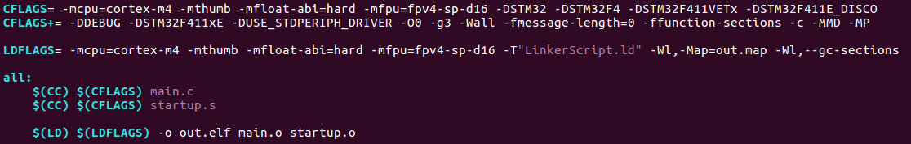

### 21/04/01 (목)
---------------------------

db memory watch 0xfffffff0

디버깅 실행
1. make gdb
2. target remote:1234
3. file out.elf
4. load
5. b main
6. si(인스트럭션 단위로 진행), s(줄 단위로 실행), n(함수단위로 실행)

----------------------------
# 1. 복습
## 1. C 코드를 ARM cortex-m4 프로세서용으로 컴파일하고, 이를 프로세서 위에 로딩 후 (QEMU virtualization) 온칩에서 실행되는 과정을 gdb를 이용하여 step instruction 추적을 통해 실행과정을 분석하시오.

1. ARM cortex-m4 프로세서 컴파일

    

    - -mcpu=cortex-m4 : 타겟 프로세서를 cortex-m4로 지정

    - -mthumb : Trace32 디버깅 프로그램 사용

    -  

-----------------------------
## 2. C로 코딩하는 다양한 사례별로 Assembly code로 변환되어 실행되는 원리를 분석하시오. 

1. 변수에 값 저장

2. 변수끼리 더하기 연산, 빼기 연산

3. 조건문

4. 반복문

5. 함수 호출

    - 함수 call과 return 과정에서 stack 메모리와 레지스터가 어떻게 사용되는지 분석

---------------------------