### 21/04/15 (목)

----------------------------
# 1. 함수 실행과정에서, cpu, registers, ram의 상호작용 측면에서 분석하기 (실습 예제를 하나 짜고, cortexm-m4 용으로 컴파일하고 생성된 어셈블리 코드를 분석)

## 1) 실습 소스파일

```c
int sum(int x, int y){
    return x + y;
}   
int main(){
    
    int x;
    int y;
    int z;

    x = 3;
    y = 5;
    z = x + y;
    z = x - y;

    z = sum(x, y);
}
```

### 2) 어셈블리 코드 분석
    
1. Main함수 시작. Data memory에 지역변수 공간 할당

    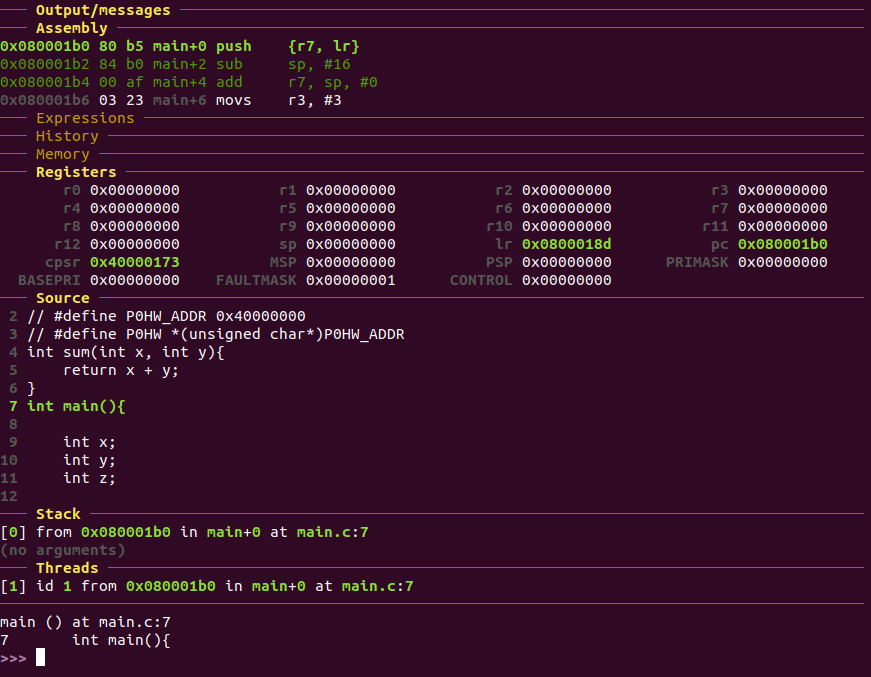


    1. 코드 메모리에 r7, lr을 할당.

    2. sp - 16을 하여 4만큼의 공간을 할당.

    2. r7레지스터에 sp - 16 주소를 저장.

    
2. 값을 로컬 변수에 저장 

    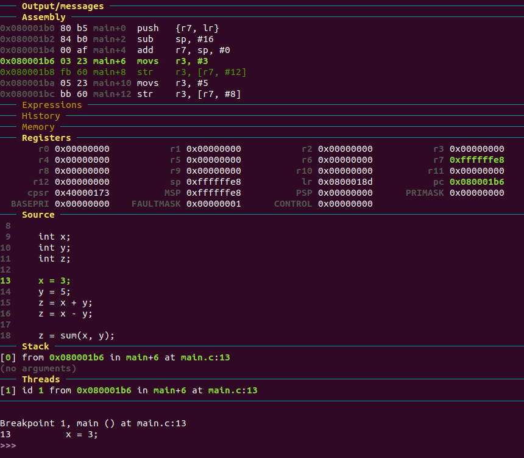

    1. r3 레지스터에 값 3을 `임시`저장. 

    2. r3 값을 r7 + 12 메모리 주소에 저장. r7 + 12 메모리 위치는 x값을 저장하기 위해 사용.

    ------

    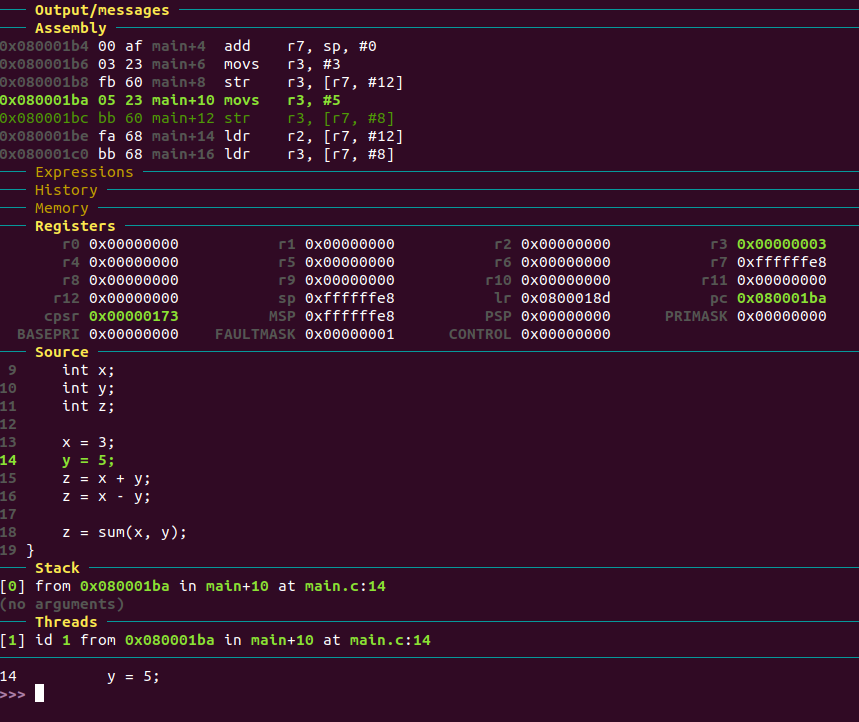

    1. r3 레지스터에 값 5를 `임시`저장. 

    2. r3 값을 r7 + 8 메모리 주소에 저장. r7 + 8 메모리 위치는 y값을 저장하기 위해 사용.


    * 메모리, 레지스터 상태

        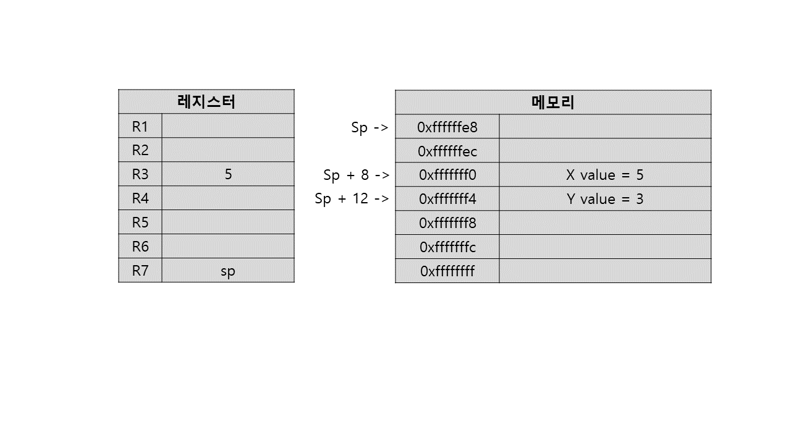


3. 연산

    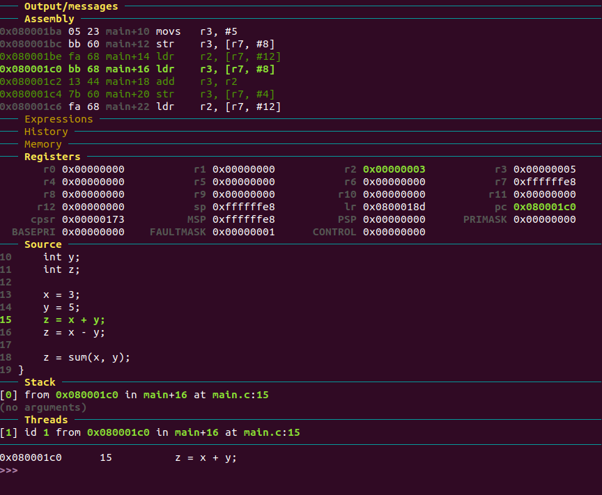

    1. r2, r3 레지스터에 x, y가 저장된 메모리 주소의 값을 각각 load하여 저장.

    2. add함수를 이용해 r3에 r2값 더하기.

    3. r3의 값을 메모리주소 r7 + 4에 저장. 이 주소는 z를 위해 사용.

    * 메모리 상태

        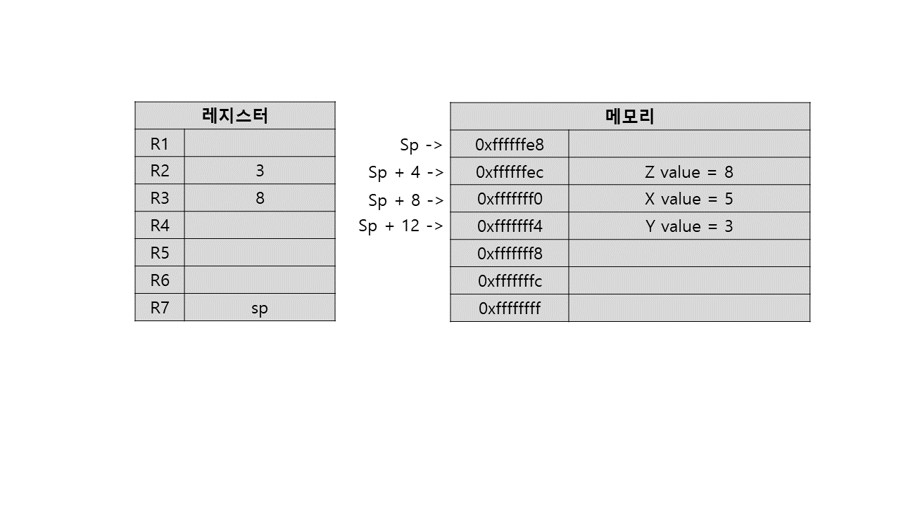

    ------

    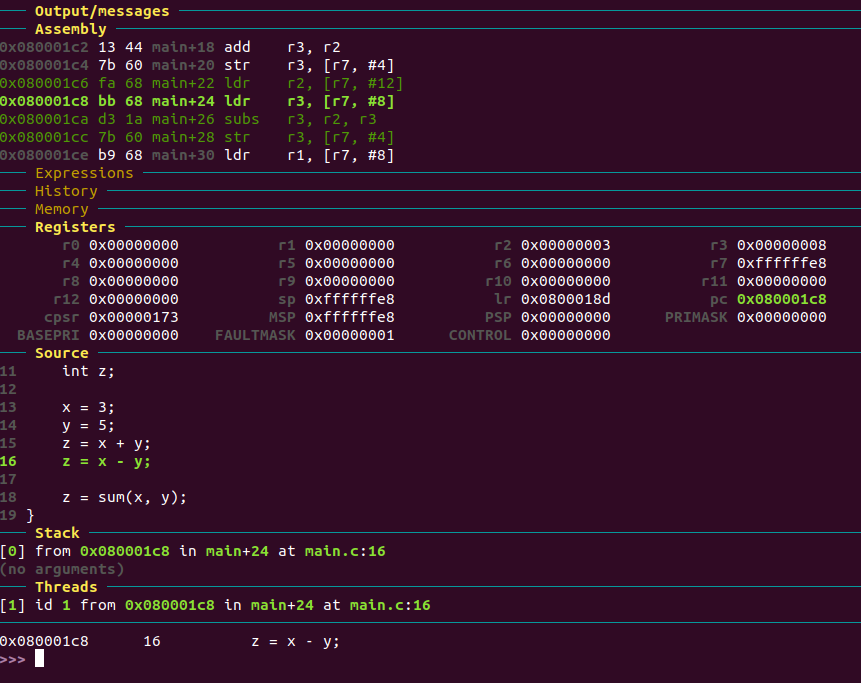

    1. r2, r3 레지스터에 x, y가 저장된 메모리 주소의 값을 각각 load하여 저장.

    2. sub함수를 이용해 r2에서 r3값 뺀 결과를 r3에 저장.

    3. r3의 값을 메모리주소 r7 + 4에 저장. 이 주소는 z를 위해 사용.

    * 레지스터, 메모리 상태

        


4. 함수 호출

    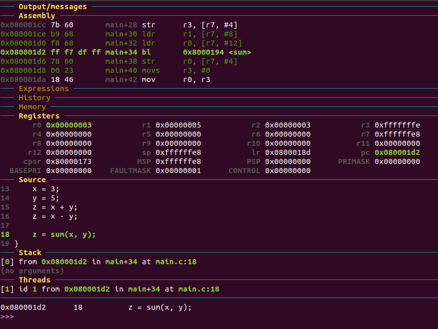

    1. 매개변수로 전달할 값들을 r0, r1에 저장한다. x, y값을 저장한 메모리 주소 참조함.

    2. sum 함수가 있는 주소로 branck한다. 이 때 pc값은 함수의 첫 주소로 바뀌고, lr에는 메인함수에서 함수 실행 다음 명령어 주소가 저장된다.

    * 메모리 상태

        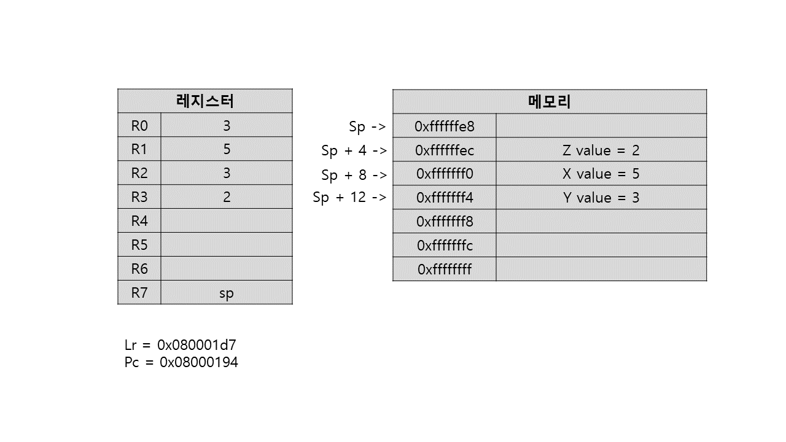

    -----
    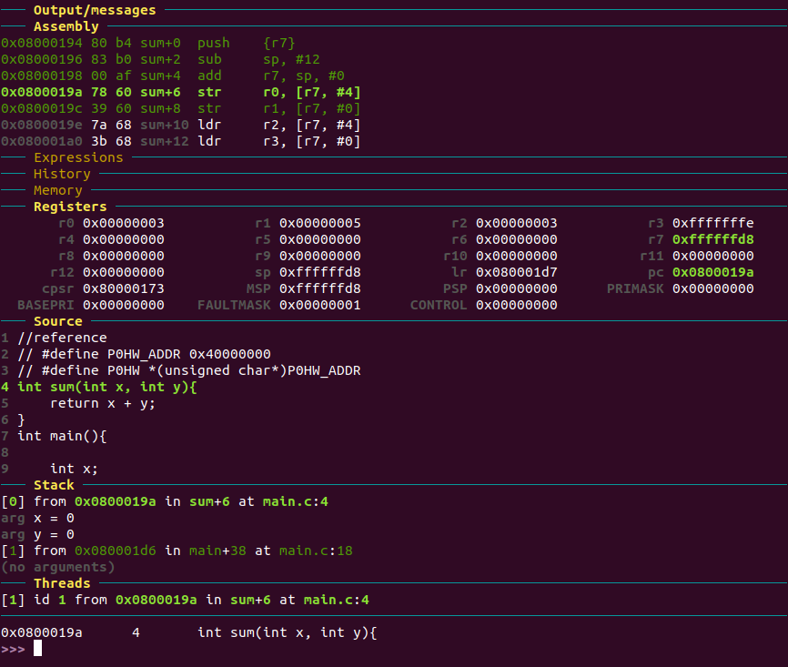

    1. sp - 12 값을 r7으로 갱신한다. 함수에서 사용 할 스택영역을 할당하는 개념.

    2. 매개변수로 받은 r0, r1 값을 r7 + 0, r7 + 4 메모리 주소에 저장한다.

    * 메모리 상태

        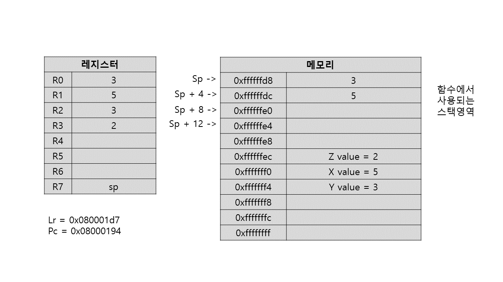

    -------
    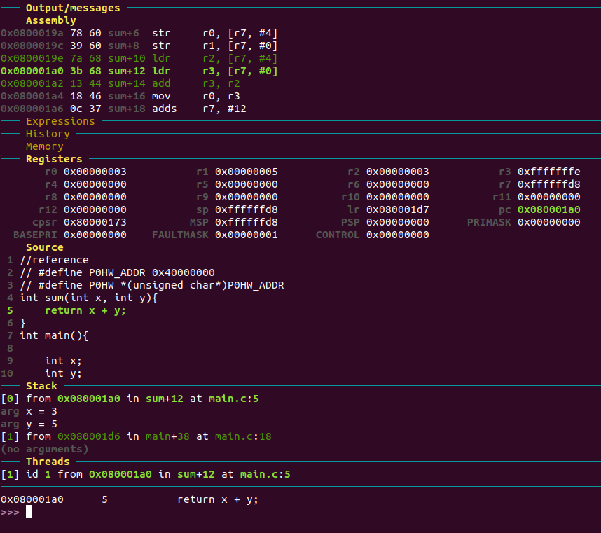

    1. r2, r3에 매개변수 값을 불러온다. 

    2. r3에 연산 결과를 저장한다. 
    
    -----
    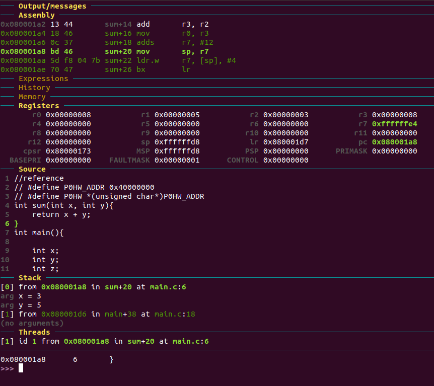

    1. r0에 r3값을 옮기는 데 r0는 리턴할 값을 저장할 레지스터로 쓰인다.

    2. r7에 다시 12를 더해줘 메인함수 영역으로 돌아온다. 

    * 메모리 상태

        

# 2. GPIO 입출력 제어와 관련하여 MCU스펙과 비교해가면서, 어떤 원리로 동작하는지 분석하고 정리하기 바랍니다.

1. 스펙문서에서 사용하고 싶은 장치와 연결된 MCU 핀을 찾는다.

2. 그 연결 핀을 활성화한다.

3. 
